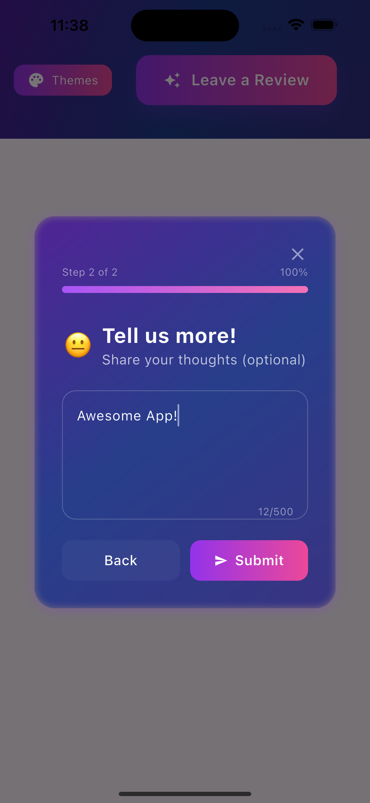
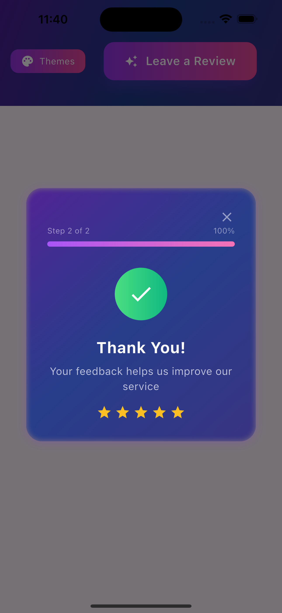
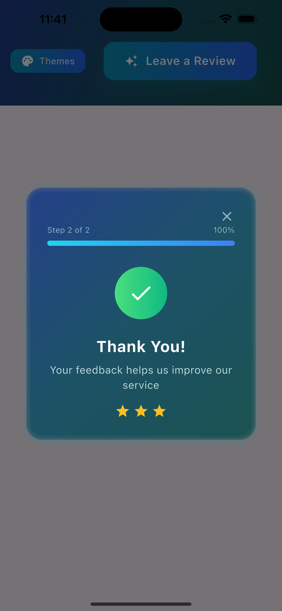

# Fancy Rating Bar

[](https://pub.dev/packages/fancy_rating_bar)
[](https://pub.dev/packages/fancy_rating_bar/score)
[](https://pub.dev/packages/fancy_rating_bar/score)

A beautiful, highly customizable Flutter rating dialog with stunning gradients, animations, glassmorphic effects, and intelligent automatic rating logic.

## Key Features

✨ **Stunning Themes**
- 6 gorgeous pre-built gradient themes
  - Aurora
  - Sunset
  - Ocean
  - Forest
  - Midnight
  - Neon
- Glassmorphic background effects
- Smooth animations and transitions

🎨 **Rich Customization**
- 9 different rating icon types (stars, hearts, thumbs, lightning, coffee, music, smile, award, gift)
- Emoji rating mode
- Combined rating & review workflow
- Custom titles and messages
- Configurable max review length

🤖 **Smart Automatic Rating**
- Automatic show/hide based on app usage
- Configurable thresholds for when to show
- Handles "show again" logic if user skips
- Remembers if user already rated on store
- Test mode for development

🏪 **App Store Integration**
- Direct links to Play Store and App Store
- Tracks when users go to rate
- Platform-specific store detection
- Thank you flow when returning from store

📱 **Multi-Platform Support**
- iOS and Android store integration
- Responsive design
- Platform-specific UI elements

## Installation

Add this to your package's `pubspec.yaml` file:

```yaml
dependencies:
  fancy_rating_bar: ^0.0.6
```

Then run:
```bash
flutter pub get
```

## Quick Start

1. Import the package:
```dart
import 'package:fancy_rating_bar/fancy_rating_bar.dart';
```

2. Add the rating check to your app:
```dart
void _showRating() {
  FancyRatingBarParams params = FancyRatingBarParams(
    theme: RatingThemes.aurora,
    playStoreUrl: "YOUR_PLAY_STORE_URL",
    appStoreUrl: "YOUR_APP_STORE_URL",
    testMode: true, // Remove this in production
  );
  
  FancyRatingBar.of(context).handleAutomaticRating(
    params: params,
    onSubmit: (response) {
      print('Rating: ${response.rating}');
    },
  );
}
```

3. Call it in your app (e.g., in `initState` or after user completes an action)

## Usage

### Method 1: Automatic Rating (Recommended)

The most convenient way to use the package is with automatic rating, which handles show/hide logic based on app usage:

```dart
import 'package:fancy_rating_bar/fancy_rating_bar.dart';

void handleAutomaticRating() {
  FancyRatingBarParams params = FancyRatingBarParams(
    theme: RatingThemes.aurora, // Choose from 6 beautiful themes
    ratingIconType: RatingIconType.stars, // 9 different icon types available
    useEmojiRating: false, // true for emoji rating
    mode: DialogMode.both, // rating, review, or both
    playStoreUrl: "https://play.google.com/store/apps/details?id=your.app.id",
    appStoreUrl: "https://apps.apple.com/app/your-app-id",
    testMode: true, // Set to false in production
    threshold: 3, // Show after 3 app launches
    showAgainThreshold: 10, // Show again after 10 launches if skipped
  );
  
  FancyRatingBar.of(context).handleAutomaticRating(
    params: params,
    onSubmit: (response) {
      print('Rating: ${response.rating}');
      print('Type: ${response.type}');
      print('Message: ${response.message}');
    },
  );
}
```

### Method 2: Manual Rating Dialog

For manual control over when to show the dialog:

```dart
import 'package:fancy_rating_bar/fancy_rating_bar.dart';

void showManualRatingDialog() {
  FancyRatingBarParams params = FancyRatingBarParams(
    theme: RatingThemes.aurora,
    ratingIconType: RatingIconType.stars,
    useEmojiRating: false,
    mode: DialogMode.both,
    playStoreUrl: "https://play.google.com/store/apps/details?id=your.app.id",
    appStoreUrl: "https://apps.apple.com/app/your-app-id",
  );

  FancyRatingBar.of(context).showRatingDialog(
    params,
    (response) {
      print('Rating: ${response.rating}');
      print('Type: ${response.type}');  
      print('Message: ${response.message}');
    },
  );
}
```

### Method 3: Direct Dialog (Legacy)

```dart
void showRatingDialog() {
  showDialog(
    context: context,
    barrierDismissible: true,
    builder: (context) => RatingFlowView(
      theme: RatingThemes.aurora,
      ratingIconType: RatingIconType.stars,
      useEmojiRating: false,
      mode: DialogMode.both,
      playStoreUrl: "https://play.google.com/store/apps/details?id=your.app.id",
      appStoreUrl: "https://apps.apple.com/app/your-app-id",
      onSubmit: (response) async {
        print('Rating: ${response.rating}');
        print('Type: ${response.type}');
        print('Message: ${response.message}');
      },
    ),
  );
}
```

### Full Customization Example

```dart
FancyRatingBarParams params = FancyRatingBarParams(
  // Theme selection
  theme: RatingThemes.neon,
  
  // Rating configuration
  ratingIconType: RatingIconType.hearts,
  useEmojiRating: false,
  mode: DialogMode.both,
  
  // Custom text
  title: 'Rate Our App',
  subtitle: 'How do you feel about our app?',
  reviewTitle: 'Write a Review',
  reviewSubtitle: 'Tell us what you think',
  storeRatingTitle: 'Love Our App?',
  storeRatingSubtitle: 'Rate us on the app store!',
  thankYouTitle: 'Thank You!',
  thankYouSubtitle: 'We appreciate your feedback',
  
  // Store URLs
  playStoreUrl: "https://play.google.com/store/apps/details?id=your.app.id",
  appStoreUrl: "https://apps.apple.com/app/your-app-id",
  
  // Behavior settings
  maxLength: 500,
  thankYouDuration: 4, // seconds
  testMode: false,
  threshold: 5, // Show after 5 app launches
  showAgainThreshold: 15, // Show again after 15 launches if skipped
);

FancyRatingBar.of(context).handleAutomaticRating(
  params: params,
  onSubmit: (response) {
    // Handle different response types
    switch (response.type) {
      case ResponseType.rated:
        print('User rated: ${response.rating} stars');
        break;
      case ResponseType.openedStoreToRate:
        print('User went to store to rate');
        break;
      case ResponseType.skippedStoreRating:
        print('User skipped store rating');
        break;
      case ResponseType.closedDialog:
        print('User closed dialog');
        break;
      default:
        print('Unknown response type');
    }
    
    if (response.message != null && response.message!.isNotEmpty) {
      print('User review: ${response.message}');
    }
  },
);
```

## Automatic Rating Logic

The package includes intelligent logic to show rating dialogs at the right time:

### When the Dialog Shows
1. **First time**: After `threshold` number of app launches (default: 3)
2. **If skipped**: Shows again after `showAgainThreshold` launches (default: 10)
3. **If user rated on store**: Never shows again
4. **Test mode**: Shows every time (for development)

### Configuration
```dart
FancyRatingBarParams(
  threshold: 5,           // Show after 5 app launches
  showAgainThreshold: 15, // If skipped, show again after 15 launches
  testMode: true,         // Always show (for testing)
  // ... other params
)
```

### Integration Example
Call this in your app's main flow (e.g., after successful login, on home screen, etc.):

```dart
void _checkRating() {
  FancyRatingBarParams params = FancyRatingBarParams(
    theme: RatingThemes.aurora,
    threshold: 3,
    showAgainThreshold: 10,
    testMode: false, // Set to true during development
    playStoreUrl: "https://play.google.com/store/apps/details?id=your.app.id",
    appStoreUrl: "https://apps.apple.com/app/your-app-id",
  );
  
  FancyRatingBar.of(context).handleAutomaticRating(
    params: params,
    onSubmit: (response) {
      // Handle the response
      print('User rated: ${response.rating}');
    },
  );
}

// Call this in your main app flow
@override
void initState() {
  super.initState();
  WidgetsBinding.instance.addPostFrameCallback((_) {
    _checkRating();
  });
}
```

## Available Themes

- `RatingThemes.aurora` - Purple and pink gradients
- `RatingThemes.sunset` - Orange and red gradients
- `RatingThemes.ocean` - Blue and cyan gradients
- `RatingThemes.forest` - Green and emerald gradients
- `RatingThemes.midnight` - Dark and elegant gradients
- `RatingThemes.neon` - Vibrant neon gradients

## Configuration Options

### Rating Icon Types
Available options for `ratingIconType`:

```dart
RatingIconType.stars       // ★ Default star icons
RatingIconType.hearts      // ♥ Heart icons  
RatingIconType.thumbs      // 👍 Thumbs up icons
RatingIconType.lightning   // ⚡ Lightning bolt icons
RatingIconType.coffee      // ☕ Coffee icons
RatingIconType.music       // 🎵 Music note icons
RatingIconType.smile       // 😊 Smile icons
RatingIconType.award       // 🏆 Award icons
RatingIconType.gift        // 🎁 Gift icons
```

### Dialog Modes
Available options for `mode`:

```dart
DialogMode.rating  // Shows only the rating step
DialogMode.review  // Shows only the review step  
DialogMode.both    // Shows both rating and review steps (default)
```

### Response Object Structure

The `onSubmit` callback receives a `Response` object with the following structure:

```dart
class Response {
  int rating;           // 1-5 star rating
  ResponseType type;    // Type of response (see below)
  String? message;      // Optional review message
}
```

**Response Types:**
- `ResponseType.rated` - User provided a rating
- `ResponseType.openedStoreToRate` - User went to app store to rate
- `ResponseType.skippedStoreRating` - User skipped the store rating prompt
- `ResponseType.closedDialog` - User closed the dialog without rating
- `ResponseType.unknown` - Unknown response type

**Example Response Handling:**
```dart
onSubmit: (response) {
  switch (response.type) {
    case ResponseType.rated:
      // User rated but didn't go to store
      analytics.track('rating_submitted', {
        'rating': response.rating,
        'has_review': response.message?.isNotEmpty ?? false,
      });
      break;
      
    case ResponseType.openedStoreToRate:
      // User went to store - likely to leave a review there
      analytics.track('store_rating_opened', {
        'rating': response.rating,
      });
      break;
      
    case ResponseType.skippedStoreRating:
      // User chose not to rate on store but may have left feedback
      analytics.track('store_rating_skipped', {
        'rating': response.rating,
      });
      break;
  }
}
```

### Complete Example with All Options

```dart
void showCompleteExample() {
  FancyRatingBarParams params = FancyRatingBarParams(
    // Theme (required)
    theme: RatingThemes.aurora,
    
    // Rating icon configuration
    ratingIconType: RatingIconType.hearts,  // Use hearts instead of stars
    useEmojiRating: true,  // Enable emoji rating mode
    
    // Dialog flow mode
    mode: DialogMode.both,  // Show both rating and review steps
    
    // Custom titles and messages
    title: 'Rate Your Experience',
    subtitle: 'How was your overall experience?',
    reviewTitle: 'Tell us more!',
    reviewSubtitle: 'Share your thoughts (optional)',
    storeRatingTitle: 'Show Some Love! ❤️',
    storeRatingSubtitle: 'Help others discover our app by rating us on the store',
    thankYouTitle: 'Thank You for Rating Us! 🎉',
    thankYouSubtitle: 'We appreciate you taking the time to rate our app',
    
    // App store URLs
    playStoreUrl: 'https://play.google.com/store/apps/details?id=com.example.app',
    appStoreUrl: 'https://apps.apple.com/app/1234567890',
    
    // Configuration options
    maxLength: 300,              // Max characters for review
    thankYouDuration: 3,         // Seconds to show thank you message
    testMode: false,             // Set to true for testing
    threshold: 3,                // Show after 3 app launches
    showAgainThreshold: 10,      // Show again after 10 launches if skipped
  );

  FancyRatingBar.of(context).handleAutomaticRating(
    params: params,
    onSubmit: (response) {
      print('Rating: ${response.rating}');
      print('Type: ${response.type}');
      print('Message: ${response.message ?? 'No message'}');
    },
  );
}
```

### Mode Behaviors

- **Rating Mode (`DialogMode.rating`)**: 
  - Shows only star/heart/emoji rating
  - Single step dialog
  - Quick rating submission
  - For high ratings (>3), redirects to app store

- **Review Mode (`DialogMode.review`)**:
  - Shows only review text field
  - Single step dialog
  - Focused on written feedback
  - Collects detailed user feedback

- **Both Mode (`DialogMode.both`)**:
  - Two-step process: Rate first, then review/store
  - For ratings >3: Shows store rating option
  - For ratings ≤3: Shows review form
  - Progress bar shows completion
  - Can navigate back to change rating

## Screenshots

### Aurora Theme
<table>
  <tr>
    <td></td>
    <td></td>
    <td></td>
  </tr>
</table>

### Sunset Theme
<table>
  <tr>
    <td></td>
    <td></td>
    <td></td>
  </tr>
</table>

### Ocean Theme
<table>
  <tr>
    <td></td>
    <td></td>
    <td></td>
  </tr>
</table>

### Forest Theme
<table>
  <tr>
    <td></td>
    <td></td>
    <td></td>
  </tr>
</table>

### Midnight Theme
<table>
  <tr>
    <td></td>
    <td></td>
    <td></td>
  </tr>
</table>

### Neon Theme
<table>
  <tr>
    <td></td>
    <td></td>
    <td></td>
  </tr>
</table>

## Additional Features

- **Smart Flow Control**: Automatically routes high ratings (>3) to app store, low ratings to review form
- **Lifecycle Tracking**: Detects when users return from app store after rating
- **Smooth Animations**: Scaling effects, fade transitions, and progress indicators
- **Progress Tracking**: Visual progress bar for multi-step flows
- **Hover Effects**: Interactive feedback on desktop/web platforms
- **Success Animations**: Celebratory animations after successful submission
- **Backdrop Blur**: Beautiful glassmorphic background effects
- **Gradient Buttons**: Stunning themed buttons matching selected theme
- **Responsive Design**: Works across all screen sizes and orientations
- **Accessibility**: Screen reader friendly with proper semantic labels
- **Platform Detection**: Automatically shows correct app store (iOS/Android)
- **Persistent Storage**: Remembers user preferences using SharedPreferences

## Best Practices

### When to Show Rating Dialog
- After user completes a successful action (purchase, level completion, etc.)
- Not immediately on app launch
- After user has had time to experience your app's value
- Consider user's workflow - don't interrupt critical tasks

### Store URL Configuration
Always test your store URLs before releasing:

```dart
// Good - Direct app links
playStoreUrl: "https://play.google.com/store/apps/details?id=com.yourcompany.yourapp"
appStoreUrl: "https://apps.apple.com/app/id1234567890"

// Bad - Generic store links  
playStoreUrl: "https://play.google.com/store"
appStoreUrl: "https://apps.apple.com/"
```

### Analytics Integration
Track rating dialog interactions for insights:

```dart
onSubmit: (response) {
  // Track with your analytics service
  FirebaseAnalytics.instance.logEvent(
    name: 'rating_dialog_interaction',
    parameters: {
      'rating': response.rating,
      'response_type': response.type.toString(),
      'has_message': response.message?.isNotEmpty ?? false,
    },
  );
}
```

### Production vs Development
```dart
FancyRatingBarParams(
  testMode: kDebugMode, // Automatically use test mode in debug builds
  threshold: kDebugMode ? 1 : 5, // Show sooner in debug
  // ... other params
)
```

## Migration Guide

### From Direct Dialog Usage
If you were using `RatingFlowView` directly:

```dart
// Old way
showDialog(
  context: context,
  builder: (context) => RatingFlowView(/* params */),
);

// New way (recommended)
FancyRatingBar.of(context).handleAutomaticRating(
  params: FancyRatingBarParams(/* params */),
  onSubmit: (response) { /* handle response */ },
);
```

## Troubleshooting

### Dialog Not Showing
- Ensure you're not in test mode and haven't reached the threshold yet
- Check if user has already rated on store (stored in SharedPreferences)  
- Verify context is available when calling `FancyRatingBar.of(context)`

### Testing During Development
```dart
FancyRatingBarParams(
  testMode: true, // This will show dialog every time
  // ... other params
)
```

### Reset User Preferences (for testing)
```dart
// Clear stored preferences to reset rating state
SharedPreferences prefs = await SharedPreferences.getInstance();
await prefs.clear();
```

### Store URLs Not Working
- Ensure URLs are correctly formatted
- Test URLs manually in browser first
- Use app-specific URLs, not generic store URLs
- Example format:
  - Play Store: `https://play.google.com/store/apps/details?id=com.example.app`
  - App Store: `https://apps.apple.com/app/id1234567890`

### Permission Issues
Add to `android/app/src/main/AndroidManifest.xml`:
```xml
<uses-permission android:name="android.permission.INTERNET" />
```

## Contributing

Contributions are welcome! If you find a bug or want to add a feature, please raise an issue or submit a PR.

## License

```
MIT License

Copyright (c) 2024 Subhadip Rudra

Permission is hereby granted, free of charge, to any person obtaining a copy
of this software and associated documentation files (the "Software"), to deal
in the Software without restriction, including without limitation the rights
to use, copy, modify, merge, publish, distribute, sublicense, and/or sell
copies of the Software, and to permit persons to whom the Software is
furnished to do so, subject to the following conditions:

The above copyright notice and this permission notice shall be included in all
copies or substantial portions of the Software.

THE SOFTWARE IS PROVIDED "AS IS", WITHOUT WARRANTY OF ANY KIND, EXPRESS OR
IMPLIED, INCLUDING BUT NOT LIMITED TO THE WARRANTIES OF MERCHANTABILITY,
FITNESS FOR A PARTICULAR PURPOSE AND NONINFRINGEMENT. IN NO EVENT SHALL THE
AUTHORS OR COPYRIGHT HOLDERS BE LIABLE FOR ANY CLAIM, DAMAGES OR OTHER
LIABILITY, WHETHER IN AN ACTION OF CONTRACT, TORT OR OTHERWISE, ARISING FROM,
OUT OF OR IN CONNECTION WITH THE SOFTWARE OR THE USE OR OTHER DEALINGS IN THE
SOFTWARE.
```