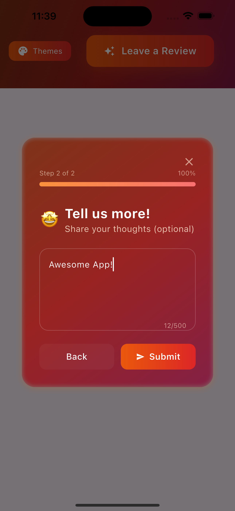
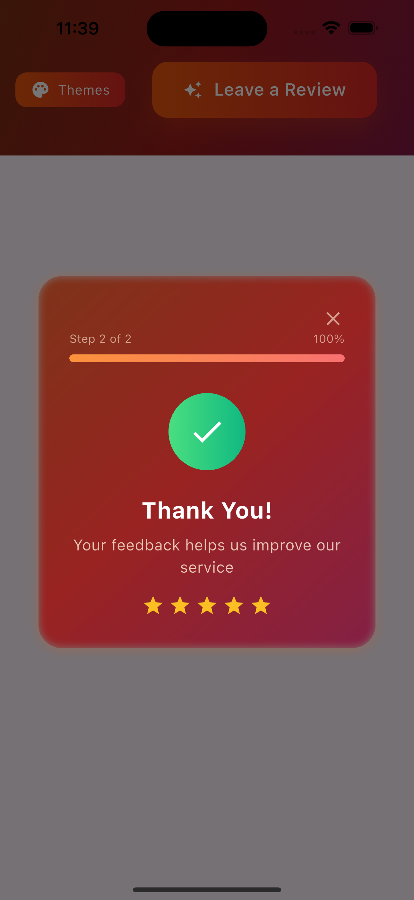
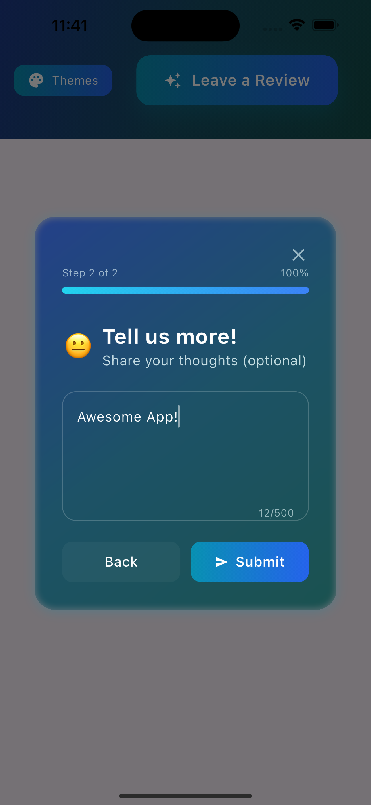

# Fancy Rating Bar

[](https://pub.dev/packages/fancy_rating_bar)
[](https://pub.dev/packages/fancy_rating_bar/score)
[](https://pub.dev/packages/fancy_rating_bar/score)

A beautiful, highly customizable Flutter rating dialog with stunning gradients, animations, and intelligent automatic rating logic. Perfect for collecting user feedback and app store ratings.

## Auto Rating Flow

```mermaid
flowchart TD
    A[🚀 Start] --> B{👥 userSessions > threshold?}
    B -->|❌ No| C[🛑 End - No Action]
    B -->|✅ Yes| D[⭐ Show Rating Dialog]
    D --> E{⭐ Rating > 3?}
    E -->|👎 No| F[📝 Show Feedback Form]
    F --> G[📤 Send Feedback to FeedbackNest]
    G --> H[✅ End - Feedback Collected]
    E -->|👍 Yes| I[🏪 Ask User to Rate on App Store/Play Store]
    I --> J{📱 User Rated?}
    J -->|✅ Yes| K[🙏 Show Thank You Message]
    K --> L[📊 Send Feedback to FeedbackNest]
    L --> M[🎉 End - Success]
    J -->|❌ No| N[⏰ Increase threshold: x = x + showAgainThreshold]
    N --> O[📅 End - Will Show Later]

    %% Enhanced Styling
    classDef startStyle fill:#4CAF50,stroke:#2E7D32,stroke-width:3px,color:#fff,font-weight:bold
    classDef decisionStyle fill:#2196F3,stroke:#1565C0,stroke-width:2px,color:#fff,font-weight:bold
    classDef actionStyle fill:#FF9800,stroke:#E65100,stroke-width:2px,color:#fff,font-weight:bold
    classDef endSuccessStyle fill:#4CAF50,stroke:#2E7D32,stroke-width:2px,color:#fff,font-weight:bold
    classDef endNeutralStyle fill:#9E9E9E,stroke:#424242,stroke-width:2px,color:#fff,font-weight:bold
    classDef feedbackStyle fill:#9C27B0,stroke:#4A148C,stroke-width:2px,color:#fff,font-weight:bold
    classDef delayStyle fill:#FF5722,stroke:#BF360C,stroke-width:2px,color:#fff,font-weight:bold

    %% Apply styles
    class A startStyle
    class B,E,J decisionStyle
    class D,F,I,K actionStyle
    class M,H endSuccessStyle
    class C endNeutralStyle
    class G,L feedbackStyle
    class N,O delayStyle
```




## 🎬 Demo Flow

<p align="center">
  
</p>

*Complete rating dialog flow showing the smart routing: rating → review (for low ratings) or app store (for high ratings) → thank you*

## 🎬 Themes

<p align="center">
  
</p>


> 💡 **Pro Tip**: Combine with [FeedbackNest Core](https://pub.dev/packages/feedbacknest_core) to automatically collect, analyze, and get insights from user ratings and reviews!

## ✨ Features

- **6 Stunning Themes**: Aurora, Sunset, Ocean, Forest, Midnight, Neon
- **9 Rating Icon Types**: Stars, hearts, thumbs, lightning, coffee, music, smile, award, gift
- **Smart Auto-Rating**: Shows at the right time based on app usage
- **App Store Integration**: Direct links to Play Store and App Store
- **Multi-Mode Support**: Rating only, review only, or both
- **Emoji Rating**: Alternative emoji-based rating system
- **Beautiful Animations**: Smooth transitions and glassmorphic effects

## 🚀 Quick Start

**Add dependency:**
```yaml
dependencies:
  fancy_rating_bar: ^0.0.6
  feedbacknest_core: ^1.0.0  # Optional: For analytics & insights
```

**Basic usage:**
```dart
import 'package:fancy_rating_bar/fancy_rating_bar.dart';
import 'package:feedbacknest_core/feedbacknest.dart'; // Optional

// Initialize FeedbackNest (optional but recommended)
void main() {
  runApp(MyApp());
  Feedbacknest.init("your_api_key", userIdentifier: "user_123");
}
//
[Get Api Key →](https://feedbacknest.app)
[See more →](https://pub.dev/packages/feedbacknest_core)


// Show rating dialog
void _showRating() {
  FancyRatingBarParams params = FancyRatingBarParams(
    theme: RatingThemes.aurora,
    playStoreUrl: "https://play.google.com/store/apps/details?id=your.app.id",
    appStoreUrl: "https://apps.apple.com/app/your-app-id",
    testMode: true, // Remove in production
  );
  
  FancyRatingBar.of(context).handleAutomaticRating(
    params: params,
    onSubmit: (response) {
      // Option 1: Use FeedbackNest for automatic analytics
      Feedbacknest.submitRatingAndReview(
        rating: response.rating,
        review: response.message ?? response.type.name,
      );
      
      // Option 2: Handle manually
      print('Rating: ${response.rating}');
    },
  );
}
```

## 📊 Why Use FeedbackNest Core?

Get powerful insights from your user feedback:

- **📈 Analytics Dashboard**: Track rating trends, user sentiment, and feedback patterns
- **🔍 AI-Powered Insights**: Automatic categorization and sentiment analysis of reviews
- **📱 Multi-Platform**: Collect feedback from web, mobile, and desktop apps
- **⚡ Real-time Alerts**: Get notified of negative feedback to respond quickly
- **📧 Export & Reporting**: Generate reports for stakeholders and team analysis

### 📊 FeedbackNest Dashboard

<p align="center">
  
</p>

*Comprehensive analytics dashboard showing ratings overview, user metrics, and detailed feedback tracking with average rating, total reviews, and positive/negative sentiment analysis*

<p align="center">
  
</p>

*Deep user insights revealing install date, usage duration, session count, device information, and comprehensive engagement metrics for each user who provided feedback*

**What you get with FeedbackNest:**
- 📊 **Real-time Dashboard**: Average rating, total feedback count, positive/negative sentiment analysis
- 👤 **User Profiles**: Track individual user journeys, app usage patterns, and engagement metrics
- ⏱️ **Usage Analytics**: Install date, active days, total sessions, sessions per day
- 📱 **Device Intelligence**: Platform, version, device model, and location data
- 🎯 **Smart Filtering**: Sort and filter feedback by user, rating, platform, date, and more

### Init Feedbacknest
```dart
Feedbacknest.init("your_api_key", userIdentifier: "user_123");
```
### Log Rating And Review In Feedbacknest
```dart
// Simple integration - FeedbackNest handles the rest!
Feedbacknest.submitRatingAndReview(
  rating: response.rating,
  review: response.message ?? '',
);
```

[Learn more about FeedbackNest →](https://feedbacknest.app)
[See more →](https://pub.dev/packages/feedbacknest_core)

## 🎨 FancyRatingBarParams Configuration

### Required Parameters

| Parameter | Type | Description |
|-----------|------|-------------|
| `theme` | `RatingTheme` | **Required**. Visual theme for the dialog |

### Automatic Rating Logic

| Parameter | Type | Default | Description |
|-----------|------|---------|-------------|
| `threshold` | `int` | `3` | Number of handleAutomaticRating() function call before showing the dialog for the first time |
| `showAgainThreshold` | `int` | `10` | Number handleAutomaticRating() after which to show dialog again if previously skipped |
| `testMode` | `bool` | `false` | If `true`, dialog shows every time (for development/testing) |

### Visual & Interaction

| Parameter | Type | Default | Description |
|-----------|------|---------|-------------|
| `ratingIconType` | `RatingIconType` | `stars` | Type of rating icons: `stars`, `hearts`, `thumbs`, `lightning`, `coffee`, `music`, `smile`, `award`, `gift` |
| `useEmojiRating` | `bool` | `false` | Use emoji-based rating instead of icons |
| `mode` | `DialogMode` | `rating` | Dialog flow: `rating`, `review`, or `both` |

### Custom Text Content

| Parameter | Type | Default | Description |
|-----------|------|---------|-------------|
| `title` | `String` | `'Rate Your Experience'` | Main title for rating step |
| `subtitle` | `String` | `'How was your overall experience?'` | Subtitle for rating step |
| `reviewTitle` | `String` | `'Tell us more!'` | Title for review step |
| `reviewSubtitle` | `String` | `'Share your thoughts (optional)'` | Subtitle for review step |
| `storeRatingTitle` | `String` | `'Show Some Love! ❤️'` | Title for store rating prompt |
| `storeRatingSubtitle` | `String` | `'Help others discover our app...'` | Subtitle for store rating prompt |
| `thankYouTitle` | `String` | `'Thank You for Rating Us! 🎉'` | Title for thank you screen |
| `thankYouSubtitle` | `String` | `'We appreciate you taking...'` | Subtitle for thank you screen |

### App Store Integration

| Parameter | Type | Default | Description |
|-----------|------|---------|-------------|
| `playStoreUrl` | `String` | `''` | Google Play Store URL for your app |
| `appStoreUrl` | `String` | `''` | Apple App Store URL for your app |

### Behavior Settings

| Parameter | Type | Default | Description |
|-----------|------|---------|-------------|
| `maxLength` | `int` | `500` | Maximum characters allowed in review text |
| `thankYouDuration` | `int` | `4` | Duration (seconds) to show thank you message |

### Available Themes
```dart
RatingThemes.aurora     // Purple and pink gradients
RatingThemes.sunset     // Orange and red gradients  
RatingThemes.ocean      // Blue and cyan gradients
RatingThemes.forest     // Green and emerald gradients
RatingThemes.midnight   // Dark and elegant gradients
RatingThemes.neon       // Vibrant neon gradients
```

### Complete Example
```dart
FancyRatingBarParams params = FancyRatingBarParams(
  // Required
  theme: RatingThemes.neon,
  
  // Automatic Logic
  threshold: 5,              // Show after 5 app launches
  showAgainThreshold: 15,    // Show again after 15 launches if skipped
  testMode: false,           // Set to true for testing
  
  // Visual & Interaction
  ratingIconType: RatingIconType.hearts,
  useEmojiRating: false,
  mode: DialogMode.both,
  
  // Custom Text
  title: 'How do you like our app?',
  subtitle: 'Your feedback helps us improve',
  reviewTitle: 'Share Your Thoughts',
  reviewSubtitle: 'Tell us what you think',
  
  // Store URLs
  playStoreUrl: "https://play.google.com/store/apps/details?id=your.app.id",
  appStoreUrl: "https://apps.apple.com/app/your-app-id",
  
  // Behavior
  maxLength: 300,
  thankYouDuration: 3,
);
```

## 🔧 Usage Options

### Automatic Rating (Recommended)
```dart
FancyRatingBar.of(context).handleAutomaticRating(
  params: params,
  onSubmit: (response) {
    Feedbacknest.submitRatingAndReview(
      rating: response.rating,
      review: response.message ?? response.type.name,
    );
  },
);
```

### Manual Dialog
```dart
FancyRatingBar.of(context).showRatingDialog(params, (response) {
  print('Rating: ${response.rating}');
});
```

### Response Types
- `ResponseType.rated` - User rated
- `ResponseType.openedStoreToRate` - Went to app store  
- `ResponseType.skippedStoreRating` - Skipped store rating
- `ResponseType.closedDialog` - Closed without rating

## 🎯 Advanced Features

- **Smart Flow**: High ratings (>3) → App Store, Low ratings → Review form
- **Automatic Logic**: Remembers user preferences, handles thresholds
- **Store Integration**: Detects when users return from app stores
- **Beautiful UI**: Glassmorphic effects, smooth animations, responsive design

## 📱 Screenshots

### Aurora Theme
<table>
  <tr>
    <td></td>
    <td></td>
    <td></td>
  </tr>
</table>

### Sunset Theme
<table>
  <tr>
    <td></td>
    <td></td>
    <td></td>
  </tr>
</table>

### Ocean Theme
<table>
  <tr>
    <td></td>
    <td></td>
    <td></td>
  </tr>
</table>

## 🔧 Troubleshooting

**Dialog not showing?**
- Set `testMode: true` for testing
- Check threshold settings
- Verify store URLs are correct

**Reset preferences for testing:**
```dart
SharedPreferences prefs = await SharedPreferences.getInstance();
await prefs.clear();
```

## 🤝 Contributing

Contributions are welcome! Please raise an issue or submit a PR for bugs or feature requests.

## 📄 License

MIT License - see [LICENSE](LICENSE) file for details.
