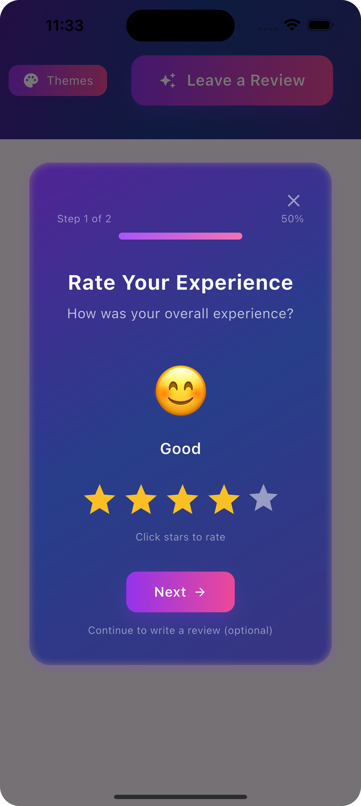
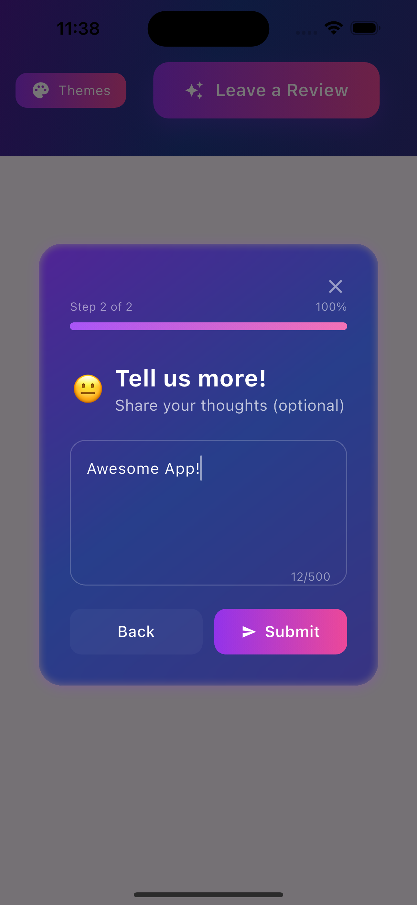
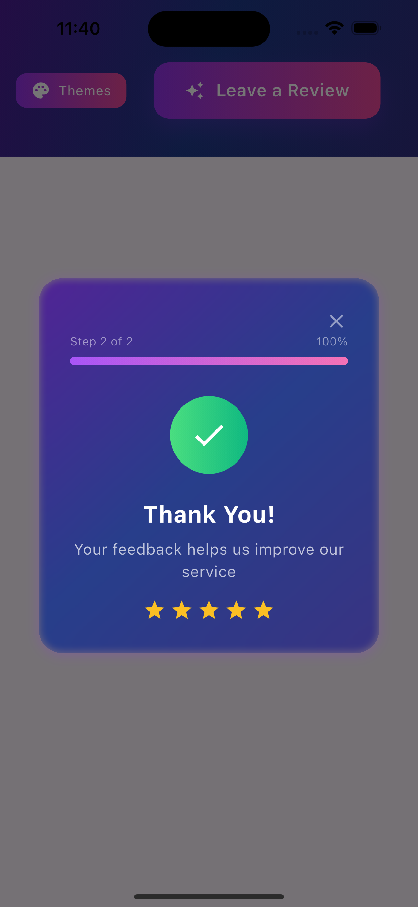
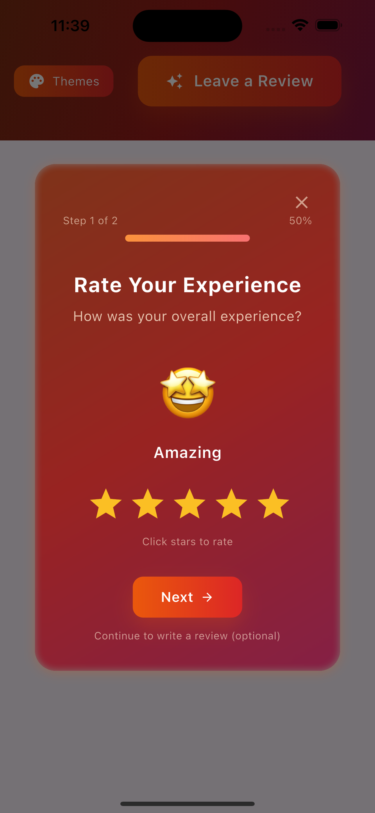
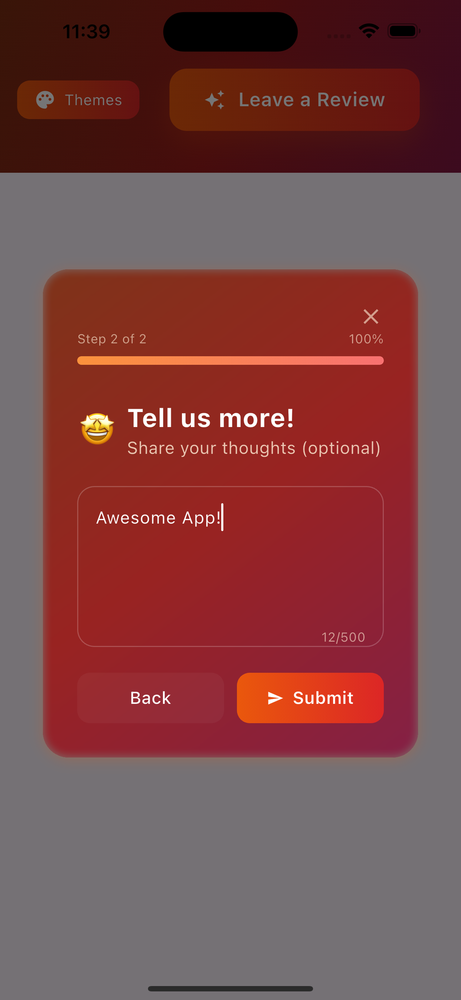
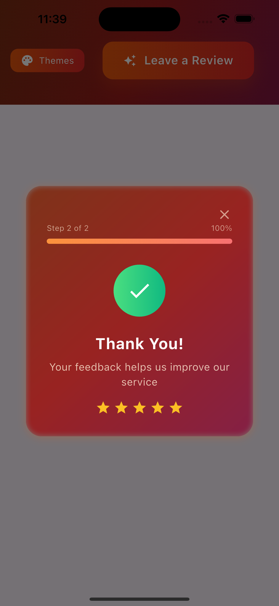
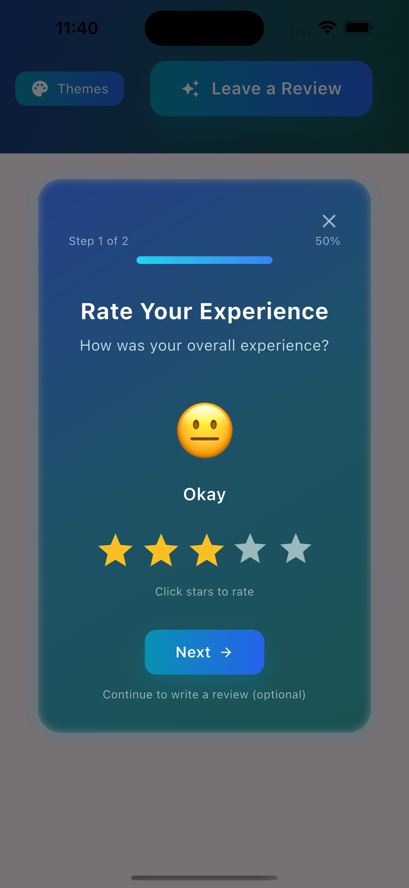
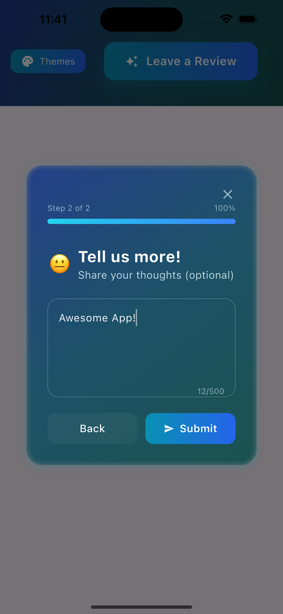
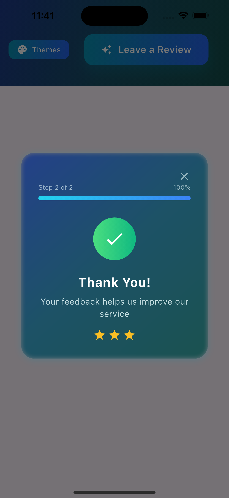

# Fancy Rating Bar

[](https://pub.dev/packages/fancy_rating_bar)
[](https://pub.dev/packages/fancy_rating_bar/score)
[](https://pub.dev/packages/fancy_rating_bar/score)

A beautiful, highly customizable Flutter rating dialog with stunning gradients, animations, and intelligent automatic rating logic. Perfect for collecting user feedback and app store ratings.

> 💡 **Pro Tip**: Combine with [FeedbackNest Core](https://pub.dev/packages/feedbacknest_core) to automatically collect, analyze, and get insights from user ratings and reviews!

## ✨ Features

- **6 Stunning Themes**: Aurora, Sunset, Ocean, Forest, Midnight, Neon
- **9 Rating Icon Types**: Stars, hearts, thumbs, lightning, coffee, music, smile, award, gift
- **Smart Auto-Rating**: Shows at the right time based on app usage
- **App Store Integration**: Direct links to Play Store and App Store
- **Multi-Mode Support**: Rating only, review only, or both
- **Emoji Rating**: Alternative emoji-based rating system
- **Beautiful Animations**: Smooth transitions and glassmorphic effects

## 🚀 Quick Start

**Add dependency:**
```yaml
dependencies:
  fancy_rating_bar: ^0.0.6
  feedbacknest_core: ^1.0.0  # Optional: For analytics & insights
```

**Basic usage:**
```dart
import 'package:fancy_rating_bar/fancy_rating_bar.dart';
import 'package:feedbacknest_core/feedbacknest.dart'; // Optional

// Initialize FeedbackNest (optional but recommended)
void main() {
  runApp(MyApp());
  Feedbacknest.init("your_api_key", userIdentifier: "user_123");
}

// Show rating dialog
void _showRating() {
  FancyRatingBarParams params = FancyRatingBarParams(
    theme: RatingThemes.aurora,
    playStoreUrl: "https://play.google.com/store/apps/details?id=your.app.id",
    appStoreUrl: "https://apps.apple.com/app/your-app-id",
    testMode: true, // Remove in production
  );
  
  FancyRatingBar.of(context).handleAutomaticRating(
    params: params,
    onSubmit: (response) {
      // Option 1: Use FeedbackNest for automatic analytics
      Feedbacknest.submitRatingAndReview(
        rating: response.rating,
        review: response.message ?? response.type.name,
      );
      
      // Option 2: Handle manually
      print('Rating: ${response.rating}');
    },
  );
}
```

## 📊 Why Use FeedbackNest Core?

Get powerful insights from your user feedback:

- **📈 Analytics Dashboard**: Track rating trends, user sentiment, and feedback patterns
- **🔍 AI-Powered Insights**: Automatic categorization and sentiment analysis of reviews
- **📱 Multi-Platform**: Collect feedback from web, mobile, and desktop apps
- **⚡ Real-time Alerts**: Get notified of negative feedback to respond quickly
- **📧 Export & Reporting**: Generate reports for stakeholders and team analysis

```dart
// Simple integration - FeedbackNest handles the rest!
Feedbacknest.submitRatingAndReview(
  rating: response.rating,
  review: response.message ?? '',
  metadata: {'source': 'mobile_app', 'version': '1.0.0'},
);
```

[Learn more about FeedbackNest →](https://feedbacknest.app)

## 🎨 Configuration

**Themes**: `aurora`, `sunset`, `ocean`, `forest`, `midnight`, `neon`

**Rating Icons**: `stars`, `hearts`, `thumbs`, `lightning`, `coffee`, `music`, `smile`, `award`, `gift`

**Modes**: `DialogMode.rating`, `DialogMode.review`, `DialogMode.both`

```dart
// Complete customization example
FancyRatingBarParams params = FancyRatingBarParams(
  theme: RatingThemes.neon,
  ratingIconType: RatingIconType.hearts,
  useEmojiRating: false,
  mode: DialogMode.both,
  threshold: 5,              // Show after 5 launches
  showAgainThreshold: 15,    // Show again after 15 if skipped
  playStoreUrl: "your_play_store_url",
  appStoreUrl: "your_app_store_url",
);
```

## 🔧 Usage Options

### Automatic Rating (Recommended)
```dart
FancyRatingBar.of(context).handleAutomaticRating(
  params: params,
  onSubmit: (response) {
    Feedbacknest.submitRatingAndReview(
      rating: response.rating,
      review: response.message ?? response.type.name,
    );
  },
);
```

### Manual Dialog
```dart
FancyRatingBar.of(context).showRatingDialog(params, (response) {
  print('Rating: ${response.rating}');
});
```

### Response Types
- `ResponseType.rated` - User rated
- `ResponseType.openedStoreToRate` - Went to app store  
- `ResponseType.skippedStoreRating` - Skipped store rating
- `ResponseType.closedDialog` - Closed without rating

## 🎯 Advanced Features

- **Smart Flow**: High ratings (>3) → App Store, Low ratings → Review form
- **Automatic Logic**: Remembers user preferences, handles thresholds
- **Store Integration**: Detects when users return from app stores
- **Beautiful UI**: Glassmorphic effects, smooth animations, responsive design

## 📱 Screenshots

### Aurora Theme
<table>
  <tr>
    <td></td>
    <td></td>
    <td></td>
  </tr>
</table>

### Sunset Theme
<table>
  <tr>
    <td></td>
    <td></td>
    <td></td>
  </tr>
</table>

### Ocean Theme
<table>
  <tr>
    <td></td>
    <td></td>
    <td></td>
  </tr>
</table>

## 🔧 Troubleshooting

**Dialog not showing?**
- Set `testMode: true` for testing
- Check threshold settings
- Verify store URLs are correct

**Reset preferences for testing:**
```dart
SharedPreferences prefs = await SharedPreferences.getInstance();
await prefs.clear();
```

## 🤝 Contributing

Contributions are welcome! Please raise an issue or submit a PR for bugs or feature requests.

## 📄 License

MIT License - see [LICENSE](LICENSE) file for details.
